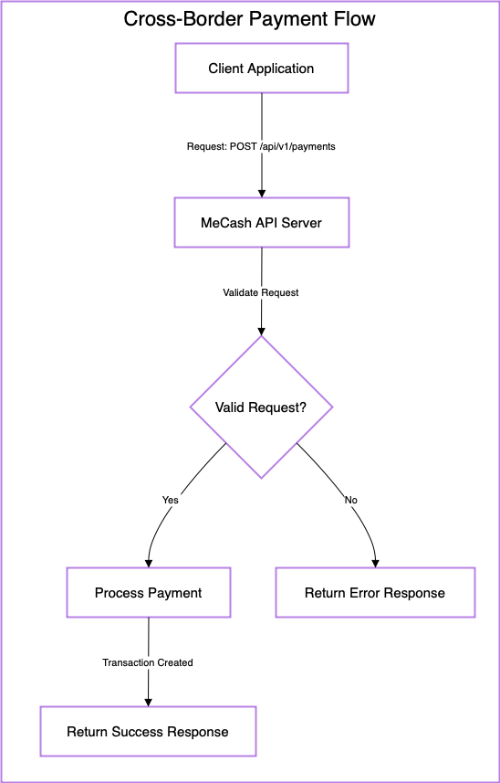

## **Overview**  
This documentation provides a detailed guide for developers that want to integrate  with the MeCash API.  
  
**API Version:** v1  
**Base URL:** `{{baseURL}}`  
**Authorization:** This endpoint requires Bearer Token authentication to ensure secure access.  
  
To start using the MeCash API, ensure you provide a valid Bearer token in the request headers for authorization.  
  
---  
  
## **Initiate Cross-Border Payment**  
Use the `POST /api/v1/payments` endpoint to securely initiate transactions between senders and recipients.




### **Endpoint**  
**Method:** `POST`  
**URL:** `{{baseURL}}/api/v1/payments`  
  
### **Required Headers**  
| Header | Description | Example |  
|--------|-------------|---------|  
| Authorization | Bearer token for authentication | `Bearer {{apiKey}}` |  
| Content-Type | Defines the request format | `application/json` |  
  
### **Request Body Parameters**  
| Parameter | Type | Description | Required |  
|-----------|------|-------------|----------|  
| amount | float | The transaction amount | Yes |  
| currency | string | The transaction currency (e.g., USD) | Yes |  
| sender.name | string | Sender’s full name | Yes |  
| sender.email | string | Sender’s email address | Yes |  
| recipient.name | string | Recipient’s full name | Yes |  
| recipient.accountNumber | string | Recipient’s bank account number | Yes |  
| recipient.bankCode | string | Recipient’s bank identifier code | Yes |  
| recipient.country | string | Recipient’s country | Yes |  
| reference | string | Unique transaction reference | Yes |  
  
#### **Request Body**  
```json  
{  
  "amount": 100.00,  
  "currency": "USD",  
  "sender": {  
    "name": "John Doe",  
    "email": "john.doe@x.com"  
  },  
  "recipient": {  
    "name": "Jane Smith",  
    "accountNumber": "0987654321",  
    "bankCode": "XYZ456",  
    "country": "USA"  
  },  
  "reference": "INV-12345"  
}  
```  
  
### **Success Response (201 Created)**  
```json  
{  
  "transactionId": "TXN789456123",  
  "status": "SUCCESS",  
  "createdAt": "2025-01-12T10:15:30Z",  
  "amount": 100.00,  
  "currency": "USD",  
  "recipient": {  
    "name": "Jane Smith",  
    "country": "USA"  
  }  
}  
```  
  
### **Error Responses**  
| HTTP Status | Error Code | Message |  
|------------|-----------|---------|  
| 400 Bad Request | INVALID_REQUEST | Invalid bank code for the recipient. |  
| 401 Unauthorized | UNAUTHORIZED | Invalid API key. |  
| 500 Internal Server Error | INTERNAL_ERROR | An unexpected error occurred. Please try again later. |  
  
---  
  
### **Error Handling**  
- Ensure the `bankCode` is correct before sending the request.  
- Use a valid API key for authentication.  
- Check the response messages for specific error details.  
  
### **Example cURL Request**  
```sh  
curl -X POST "{{baseURL}}/api/v1/payments" \  
     -H "Authorization: Bearer {{apiKey}}" \  
     -H "Content-Type: application/json" \  
     -d '{  
       "amount": 100.00,  
       "currency": "USD",  
       "sender": {  
         "name": "John Doe",  
         "email": "john.doe@x.com"  
       },  
       "recipient": {  
         "name": "Jane Smith",  
         "accountNumber": "0987654321",  
         "bankCode": "XYZ456",  
         "country": "USA"  
       },  
       "reference": "INV-12345"  
     }'  
```

